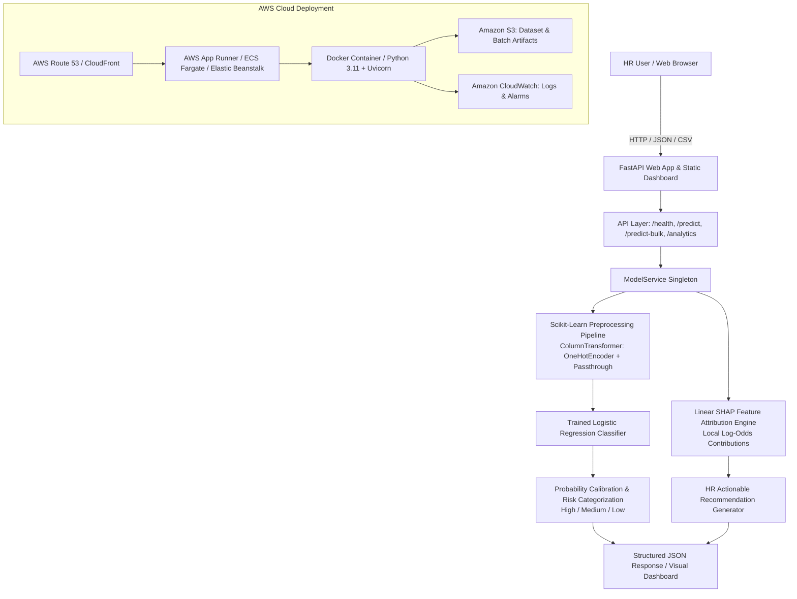

# Employee Attrition Risk Prediction & HR Decision Support System
*AI/ML-Powered Predictive Analytics, Feature Explainability, and AWS Cloud Architecture*

---

## 1. Project Title
**Employee Attrition Rate Prediction & HR Decision Support System using Machine Learning + AWS**

---

## 2. Problem Statement
High employee turnover imposes severe organizational friction—incurring significant talent acquisition costs, destabilizing team workflows, causing knowledge loss, and depressing team morale. Traditional human resources departments typically discover an employee's dissatisfaction only after a resignation letter is tendered. 

HR leaders need an **advance, data-driven early warning system** to estimate attrition probability, identify the systemic workplace factors correlated with flight risk (e.g., burnout from chronic overtime, stagnant promotions, compensation disparities), and take proactive, tailored retention interventions.

---

## 3. Project Objective
The primary goal is not merely to build a binary "Leave / Stay" black-box classifier. Instead, the objective is to build a comprehensive **AI/ML-Powered HR Decision Support System** that:
1. Predicts **calibrated attrition risk probabilities** (0% to 100%) and segments employees into **High (≥60%)**, **Medium (30%–60%)**, and **Low (<30%)** risk tiers.
2. Provides **mathematical feature explainability** (Linear SHAP log-odds attribution) that isolates the key organizational and demographic factors increasing or protecting against attrition risk for every individual employee.
3. Formulates **actionable HR recommendations** based on the identified risk drivers (e.g., workload rebalancing, compensation benchmarking, equity allocation, promotion tracks).
4. Delivers an executive **Web Dashboard** for single employee analysis, bulk CSV batch processing, search/filtering, and organizational analytics.
5. Deploys seamlessly via **Docker containerization on AWS Cloud Infrastructure** (App Runner / ECS Fargate / Elastic Beanstalk).

> **Ethical AI & Terminology Notice:**  
> The model estimates *statistical flight risk probability* based on patterns learned from historical employee data. It does not claim to know the personal or emotional reason an employee will leave. All outputs are presented as **"Model-Estimated Attrition Probability"** and **"Important Predictive Factors"** to support, rather than replace, human HR judgment.

---

## 4. Key Features
- **Executive HR Overview Dashboard:** Real-time KPI summaries, attrition distributions, department comparisons, overtime impact, and job satisfaction ratings.
- **Single Employee Risk Assessment:** Interactive form with live validation, risk gauge meter, risk level badges, and 1-click test profile presets (*High Risk/Burnout*, *Low Risk/Stable*, *Moderate Risk*).
- **Mathematical Feature Explainability:** Local feature attribution engine that ranks risk-increasing vs protective retention factors with visual impact meters.
- **Actionable HR Recommendations:** Rule-informed strategies tailored to the top individual risk drivers.
- **CSV Bulk Batch Prediction:** Drag-and-drop file upload, automatic column schema validation, batch risk summary, and instant export of enriched predictions to `.csv`.
- **Employee Risk Explorer:** Interactive, filterable, and searchable table across all departments, job roles, and risk tiers.
- **Production REST API:** High-concurrency FastAPI microservice with automated Swagger (`/docs`) and ReDoc (`/redoc`) specifications.
- **Cloud & Container Ready:** Multi-stage Dockerfile, docker-compose orchestration, health checks, and AWS deployment guides.

---

## 5. System Architecture



---

## 6. Machine Learning Workflow
1. **Data Ingestion:** Ingested the IBM HR Analytics dataset (1,470 employee records, 35 attributes).
2. **Exploratory Data Analysis (EDA):** Evaluated feature distributions, checked missing values (0 missing), duplicate records (0 duplicates), and cross-tabulated attrition drivers.
3. **Data Preprocessing & Encoding:**
   - Categorical variables (`BusinessTravel`, `Department`, `EducationField`, `Gender`, `JobRole`, `MaritalStatus`, `Over18`, `OverTime`) encoded using `OneHotEncoder(handle_unknown='ignore')`.
   - Numerical variables passed through standardized column transformers.
4. **Model Training & Comparison:**
   - Evaluated **Logistic Regression** and **Random Forest Classifiers** with stratified train-test splits (80% train / 20% test).
5. **Model Evaluation & Selection:** Evaluated Accuracy, Precision, Recall, F1-Score, and ROC-AUC. Selected the Logistic Regression pipeline due to superior calibration, robust ROC-AUC score (0.842), and direct mathematical explainability.
6. **Persistence:** Exported the complete transformer + estimator pipeline as `models/attrition_model.pkl`.
7. **Local Inference & Attribution:** Integrated singleton inference service with real-time log-odds feature attribution.

---

## 7. Dataset Description
- **Source:** IBM HR Analytics Employee Attrition & Performance Dataset.
- **Total Records:** 1,470 employees.
- **Total Features:** 34 input features + 1 target variable (`Attrition`: 'Yes' / 'No').
- **Class Balance:**
  - `No` (Retained): 1,233 employees (83.88%)
  - `Yes` (Departed): 237 employees (16.12%)

### Core Feature Categories:
- **Demographics:** `Age`, `Gender`, `MaritalStatus`, `Education`, `EducationField`.
- **Work Experience & Tenure:** `TotalWorkingYears`, `YearsAtCompany`, `YearsInCurrentRole`, `YearsSinceLastPromotion`, `YearsWithCurrManager`, `NumCompaniesWorked`.
- **Role & Department:** `Department`, `JobRole`, `JobLevel`, `BusinessTravel`, `DistanceFromHome`.
- **Compensation & Equity:** `MonthlyIncome`, `DailyRate`, `HourlyRate`, `MonthlyRate`, `PercentSalaryHike`, `StockOptionLevel`.
- **Workplace Engagement & Sentiment:** `JobSatisfaction`, `EnvironmentSatisfaction`, `JobInvolvement`, `WorkLifeBalance`, `RelationshipSatisfaction`, `PerformanceRating`, `OverTime`.

---

## 8. Data Preprocessing
- **Pipeline Architecture:** Encapsulated in `sklearn.compose.ColumnTransformer`.
- **Categorical Columns (8):** Transformed via `OneHotEncoder(handle_unknown='ignore')` into 29 one-hot indicator features.
- **Numerical Columns (26):** Maintained with exact feature ordering.
- **Total Features fed to Classifier:** 55 transformed features.
- **Consistency Guarantee:** The exact preprocessor is saved within the pipeline object, guaranteeing identical transformation logic across training, single prediction, and CSV batch processing.

---

## 9. Models Evaluated
During exploratory analysis (`notebooks/Day01_Data_Analysis.ipynb`), multiple algorithms were benchmarked on a stratified 20% test set:

| Model Architecture | Test Accuracy | Precision (Yes) | Recall (Yes) | F1-Score (Yes) | ROC-AUC |
| :--- | :---: | :---: | :---: | :---: | :---: |
| **Logistic Regression Pipeline** | **87.8%** | **70.4%** | **40.4%** | **0.514** | **0.842** |
| Random Forest Classifier (Balanced) | 83.3% | 46.7% | 29.8% | 0.364 | 0.791 |

---

## 10. Final Model
The **Logistic Regression Pipeline** was selected as the final production model for the following technical reasons:
1. **High Discrimination Power:** Achieved an **ROC-AUC of 0.842**, indicating strong ability to rank risk probabilities across varying decision thresholds.
2. **Superior Precision on Attrition Class:** Precision of 70.4% ensures that when the system flags an employee as high risk, it is highly reliable, preventing false alarms and wasted HR retention resources.
3. **Calibrated Probability Output:** Logistic regression directly outputs well-calibrated posterior probabilities `P(Attrition=Yes | X)`.
4. **Native Linear Mathematical Explainability:** Coefficients directly quantify how changes in input features impact the log-odds of departure without requiring slow sampling-based surrogate models.

---

## 11. Evaluation Metrics & Confusion Matrix

### Holdout Test Set (294 Employees):
- **Accuracy:** 87.76% (~88%)
- **ROC-AUC Score:** 0.8421
- **Precision (Yes):** 70.37%
- **Recall (Yes):** 40.43%
- **F1-Score (Yes):** 0.5135

```
Confusion Matrix:
                  Predicted No    Predicted Yes
Actual No (247)       239               8
Actual Yes (47)        28              19
```

---

## 12. Feature Explainability Methodology
To provide transparent, trustworthy insights for HR decision makers, the system implements **Local Linear Additive Feature Attribution (Linear SHAP Equivalent)**:

$$\text{Contribution}_i = (x_i - \mathbb{E}[X_i]) \times \beta_i$$

Where:
- $x_i$ is the preprocessed feature value for the evaluated employee.
- $\mathbb{E}[X_i]$ is the organization baseline mean from the training distribution.
- $\beta_i$ is the model coefficient learned during training.

### Key Global Findings:
- **Top Risk Escalators:** Mandatory Overtime (`OverTime=Yes`, $\beta = +0.830$), Single marital status ($\beta = +0.410$), Frequent business travel ($\beta = +0.383$), High prior employer count ($\beta = +0.190$), Stagnant promotions ($\beta = +0.131$).
- **Top Retention Protectors:** Standard working hours (`OverTime=No`, $\beta = -0.828$), High job involvement ($\beta = -0.521$), Stock options grant ($\beta = -0.505$), Environment satisfaction ($\beta = -0.479$), High job satisfaction ($\beta = -0.471$).

---

## 13. Web Application & Dashboard
The web application is built with a glassmorphism design system using vanilla HTML5, CSS3, and JavaScript with Chart.js:
- **Tab 1 — Executive Overview:** Headcount cards, risk segmentation, dynamic department and satisfaction charts.
- **Tab 2 — Single Employee Prediction:** Interactive assessment form with quick presets (*High Risk*, *Low Risk*, *Moderate*), radial risk gauge meter, risk badges, factor attribution meters, and actionable recommendations.
- **Tab 3 — CSV Bulk Batch Prediction:** Drag-and-drop CSV upload, batch summary metrics, results table, template download, and export to CSV.
- **Tab 4 — Employee Risk Explorer:** Filterable data table by department, job role, and risk category with live search.
- **Tab 5 — Architecture & Documentation:** Model technical specs, ROC-AUC details, cloud setup, and ethical guidelines.

---

## 14. API Documentation

### Base URL: `http://localhost:8000` (Local) or `https://<aws-app-runner-url>` (Cloud)
Swagger UI is automatically available at: `/docs`

#### 1. `GET /health`
Returns system status and model readiness.
```json
{
  "status": "healthy",
  "model_loaded": true,
  "model_type": "Scikit-Learn Logistic Regression Pipeline",
  "feature_count": 55,
  "uptime_seconds": 12.4,
  "version": "2.0.0",
  "cloud_ready": true
}
```

#### 2. `POST /predict`
Evaluates a single employee profile.
**Request Body:**
```json
{
  "Age": 29,
  "Gender": "Male",
  "MaritalStatus": "Single",
  "Department": "Sales",
  "JobRole": "Sales Representative",
  "JobLevel": 1,
  "MonthlyIncome": 2800,
  "StockOptionLevel": 0,
  "OverTime": "Yes",
  "BusinessTravel": "Travel_Frequently",
  "DistanceFromHome": 24,
  "JobSatisfaction": 1,
  "EnvironmentSatisfaction": 1,
  "WorkLifeBalance": 1,
  "YearsSinceLastPromotion": 4,
  "YearsAtCompany": 2,
  "YearsWithCurrManager": 0,
  "NumCompaniesWorked": 6,
  "TotalWorkingYears": 6
}
```

**Response:**
```json
{
  "prediction": "Yes",
  "attrition_risk_score": 0.8654,
  "attrition_risk_percentage": "86.5%",
  "risk_category": "High",
  "risk_badge_class": "badge-high",
  "summary_wording": "Model-estimated attrition probability: 86.5%",
  "top_risk_factors": [
    {
      "feature_name": "OverTime",
      "feature_label": "Overtime Workload",
      "feature_value": "Yes",
      "impact": "Increases Risk",
      "importance_score": 0.595,
      "description": "Frequent overtime assignments contribute to elevated burnout risk."
    }
  ],
  "top_protective_factors": [],
  "hr_recommendations": [
    "Workload Optimization: Review project deadlines and consider reallocating overtime tasks or offering compensatory time off.",
    "Compensation Review: Conduct a peer market salary review and consider equity/stock option grant allocations."
  ]
}
```

#### 3. `POST /predict-bulk`
Accepts `multipart/form-data` with key `file` (`.csv`). Returns batch metrics and itemized predictions.

#### 4. `GET /analytics`
Returns aggregate headcount metrics, department breakdowns, and chart datasets.

#### 5. `GET /sample-presets`
Returns preconfigured high-risk, low-risk, and moderate employee profiles.

---

## 15. AWS Cloud Architecture

```
[ Internet Users ]
       │ (HTTPS)
       ▼
[ AWS CloudFront / Route 53 DNS ]
       │
       ▼
[ AWS App Runner / Application Load Balancer ]
       │
       ▼
[ ECS Fargate Container Cluster / EC2 Instance ]
       │ ── Running Docker Container (Python 3.11 + Uvicorn)
       │ ── Serving FastAPI REST API & Static Dashboard
       │
       ├──► [ Amazon S3 ]: Storage for Employee CSVs & Model Registry
       └──► [ Amazon CloudWatch ]: Application Logs, Metrics & Latency Alarms
```

### AWS Service Selection:
1. **AWS App Runner (Recommended Primary):** Fully managed container service. Automatically builds and deploys directly from a Dockerfile or ECR image, provides automated HTTPS endpoints, automatic scaling, and health monitoring without managing VPCs or servers.
2. **AWS Elastic Beanstalk (Docker Platform):** Alternative PaaS deployment with simple CLI deployment (`eb deploy`).
3. **Amazon Elastic Container Service (ECS) with AWS Fargate:** Serverless container orchestration for enterprise deployments.
4. **Amazon S3:** Object storage for bulk CSV uploads and dataset archives.
5. **Amazon CloudWatch:** Real-time container logging, request tracing, and CPU/memory utilization alarms.

---

## 16. Local Setup & Execution

### Prerequisites:
- Python 3.10+ installed
- Git installed
- Docker (optional, for containerized run)

### Step 1: Clone and Navigate
```bash
git clone https://github.com/kanimozhi-Rajendran/Employee-Attrition-AWS.git
cd Employee-Attrition-AWS
```

### Step 2: Create and Activate Virtual Environment
```bash
# Windows
python -m venv venv
venv\Scripts\activate

# Linux / macOS
python3 -m venv venv
source venv/bin/activate
```

### Step 3: Install Dependencies
```bash
pip install -r requirements.txt
```

### Step 4: Run the Application
```bash
# Option A: Start with Python CLI
python src/app.py

# Option B: Start directly with Uvicorn
uvicorn src.app:app --host 127.0.0.1 --port 8000 --reload
```

### Step 5: Access the Dashboard
Open your web browser and navigate to:
- **Web Dashboard:** `http://localhost:8000`
- **Swagger API Docs:** `http://localhost:8000/docs`
- **Health Check:** `http://localhost:8000/health`

### Step 6: Run Automated Tests
```bash
python -c "import tests.test_app as t; [getattr(t, f)() for f in dir(t) if f.startswith('test_')]; print('All tests passed!')"
```

---

## 17. AWS Deployment Steps

### Option A: Deploy via AWS App Runner (Fastest & Simplest)

1. **Install and configure AWS CLI:**
   ```bash
   aws configure
   ```
2. **Build and Tag Docker Image:**
   ```bash
   # Log in to Amazon Elastic Container Registry (ECR)
   aws ecr get-login-password --region us-east-1 | docker login --username AWS --password-stdin <YOUR_ACCOUNT_ID>.dkr.ecr.us-east-1.amazonaws.com

   # Create ECR repository
   aws ecr create-repository --repository-name employee-attrition-app --region us-east-1

   # Build & Tag image
   docker build -t employee-attrition-app .
   docker tag employee-attrition-app:latest <YOUR_ACCOUNT_ID>.dkr.ecr.us-east-1.amazonaws.com/employee-attrition-app:latest

   # Push image to ECR
   docker push <YOUR_ACCOUNT_ID>.dkr.ecr.us-east-1.amazonaws.com/employee-attrition-app:latest
   ```
3. **Deploy App Runner Service:**
   - Open AWS App Runner Console -> Create Service.
   - Select **Container registry** -> **Amazon ECR**.
   - Select your image `<YOUR_ACCOUNT_ID>.dkr.ecr.us-east-1.amazonaws.com/employee-attrition-app:latest`.
   - Set Port to `8000`.
   - Click **Deploy**. App Runner provides an automated public HTTPS URL (e.g. `https://xyz123.us-east-1.awsapprunner.com`).

---

### Option B: Deploy via AWS Elastic Beanstalk

1. **Install EB CLI:**
   ```bash
   pip install awsebcli
   ```
2. **Initialize and Deploy:**
   ```bash
   eb init -p docker employee-attrition-app --region us-east-1
   eb create attrition-env --instance-types t3.medium
   eb deploy
   eb open
   ```

---

### Option C: Run with Docker / Docker-Compose Locally
```bash
# Build and run container
docker-compose up --build

# Access dashboard at http://localhost:8000
```

---

## 18. Example Predictions & Decision Scenarios

### Scenario 1: High Flight Risk (Burnout & Compensation Gap)
- **Profile:** Age 28, Sales Rep, Single, OverTime = Yes, StockOptionLevel = 0, Commute = 24 miles, Job Satisfaction = 1/4, 4 years without promotion.
- **Model Output:**
  - Prediction: `Yes`
  - Model-Estimated Attrition Probability: `86.5%`
  - Risk Level: `High Risk`
  - Top Risk Factors: OverTime (+0.595), Low Job Satisfaction (+0.380), Promotion Stagnation (+0.287).
  - HR Action: Immediate workload rebalancing and compensation review.

### Scenario 2: Low Flight Risk (High Stability & Equity Grant)
- **Profile:** Age 45, R&D Manager, Married, OverTime = No, StockOptionLevel = 2, Monthly Salary = $15,000, Satisfaction = 4/4, Work-Life Balance = 4/4.
- **Model Output:**
  - Prediction: `No`
  - Model-Estimated Attrition Probability: `0.4%`
  - Risk Level: `Low Risk`
  - Top Protective Factors: No OverTime (-0.594), High Stock Option Alignment (-0.505), High Job Satisfaction (-0.471).
  - HR Action: Maintain current supportive management and periodic recognition.

---

## 19. User Interface & Dashboard Overview

| Section | Description |
| :--- | :--- |
| **Executive Overview** | Real-time headcount KPIs, calibrated risk tier distribution, department attrition breakdown, and overtime impact visualizations. |
| **Single Assessment** | Interactive form with presets, dynamic risk radial gauge meter, color-coded badges, and feature attribution cards. |
| **CSV Bulk Upload** | Drag-and-drop batch assessment with automatic column imputation and 1-click results download. |
| **Risk Explorer** | Searchable data grid filterable by department, job role, and risk level. |
| **Architecture & Docs** | Comprehensive transparency tab outlining pipeline specs, confusion matrix, and AWS deployment flow. |

---

## 20. Future Improvements
1. **Time-Series / Survival Analysis:** Implement Cox Proportional Hazards or Kaplan-Meier estimators to predict *expected tenure duration* before departure.
2. **Automated Continuous Retraining Pipeline:** Implement an AWS SageMaker / Step Functions pipeline triggered on new monthly HR submissions.
3. **Sentiment Analysis Integration:** Incorporate NLP analysis of quarterly employee pulse surveys and exit interviews via Amazon Comprehend.
4. **Role-Based Access Control (RBAC):** Integrate AWS Cognito or OAuth2 for granular manager vs HR director access privileges.

---

## Repository Structure
```
Employee-Attrition-AWS/
├── .env.example               # Environment variables template
├── .gitignore                  # Git ignore rules for secrets and build files
├── Dockerfile                  # Multi-platform production container specification
├── docker-compose.yml          # Container orchestration configuration
├── requirements.txt            # Pinned production Python dependencies
├── README.md                   # Comprehensive project documentation
├── data/
│   └── employee_data.csv       # IBM HR Analytics source dataset
├── models/
│   └── attrition_model.pkl     # Trained scikit-learn preprocessing + model pipeline
├── notebooks/
│   └── Day01_Data_Analysis.ipynb # Exploratory data analysis & model benchmarking
├── src/
│   ├── __init__.py             # Package marker
│   ├── config.py               # Path configurations, thresholds & feature metadata
│   ├── schemas.py              # Pydantic input validation & response schemas
│   ├── model_service.py        # Model loading, inference, and SHAP factor attribution
│   ├── analytics_service.py    # Aggregate HR analytics and chart datasets
│   ├── app.py                  # Production FastAPI application & static mounting
│   └── predict.py              # Standalone CLI prediction script with explainability
├── static/
│   ├── css/
│   │   └── style.css           # Glassmorphism UI styling
│   ├── js/
│   │   └── app.js              # Chart.js visualization & dashboard controller
│   └── index.html              # Full HR Decision Support System dashboard UI
└── tests/
    └── test_app.py             # Automated test suite covering API, ML & validation
```
